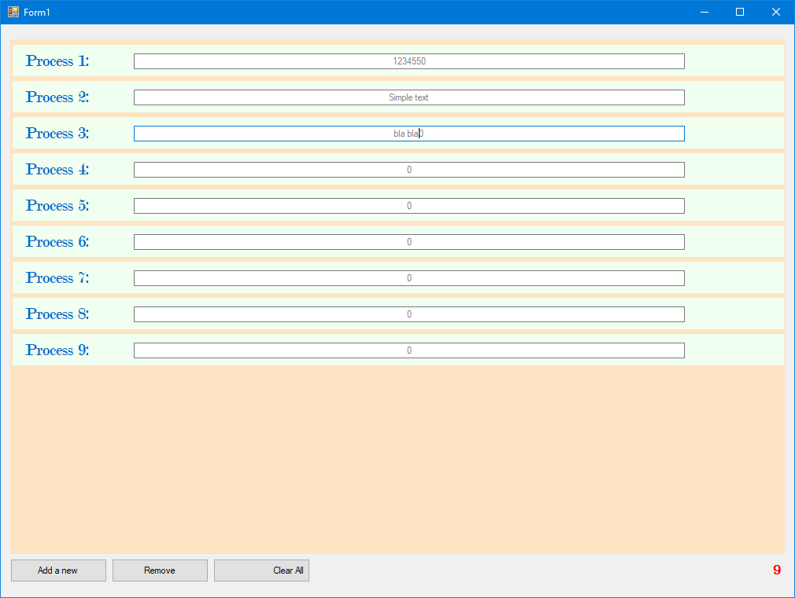

[](https://github.com/dotnet/winforms/blob/master/LICENSE.TXT)

At the same time is a IN development C# dynamic creation of controls, labels, textboxes, panels, etc. This poject created using C# (.NET/WinForms).

## About

A simple class for creating panels, labels, textboxes and forms dynamicly using Windows Forms (WinForms), explained in a simple and straightforward way.
You can create as many controls as you want and maybe even delete them. Also you can clear all created controls (Soon).

## App requirements
* Visual Studio 2017 (15.7.4)+ Or Visual Studio 2019 (Tested both of them)
* .NET Framework (4.6.2+)

## Usage
### Installation

### For VIsual Studio 2019
If you're using VS 2019 you can simply clone this project and open it in Visual Studio by cloning 
```
git clone https://github.com/MIMAXUZ/WinForms-dynamic-controls.git
```

### For VIsual Studio 2017
* Download it in .ZIP file
* Extract .zip file
* Open VIsual Studio
* file -> open -> project and select the project
* Upade model to your server configuration. (Default server name (.))

## Screenshots
1. Press F5 or CTRL + F5 to start the program.



## About Creator
- Created By O'ktam Yaqubov (MIMAXUZ)

Note: See officially supported [mimaxuz97@gmail.com](https://github.com/mimaxuz).
